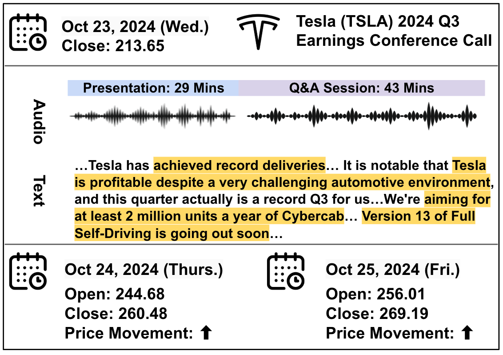
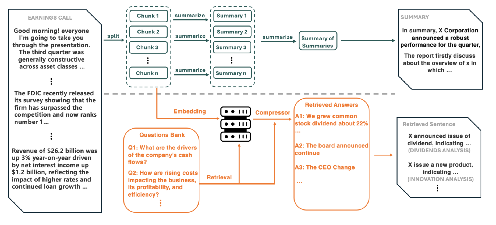

========================================================================
ECC Analyzer
========================================================================

The earnings conference call (ECC) is a teleconference or webcast held quarterly by a public company. Stakeholders (including analysts, investors, and the media) participate to obtain the company’s latest financial status. First, the company’s CEO/CFO highlights
the quarterly financial status, strategic initiatives, and forward-looking plans. Then, analysts and investors ask questions in the Q&A sessions. The release of ECCs is correlated with market reactions, making them an important resource for analyzing market changes.

- Earning Conference Calls (ECC) Example: 

An example of Tesla 2024 Q3 ECC, as shown in above figure, has 72 minutes. The call includes 29 minutes presentation by Tesla CEO Elon Musk, followed by 43 minutes Q&A session. First, CEO Elon
Musk summarized Tesla’s Q3 revenue and car production status and underscored Tesla’s ongoing strategy to hasten the global transition to sustainable energy. In the end, Musk reiterated Tesla’s preparations for introducing more affordable models. In the Q&A
session, Tesla’s executive team responded to questions about product research and development, upcoming product plans, Tesla’s Full Self-Driving offerings, etc. Owing to good revenue performance and car production, Tesla’s stock price sustained an upward trend
in the following two days. The entire ECC is saved as a ".mp3/.wav" audio file, and the corresponding transcript is also recorded. Both audio and text data can be accessed or analyzed by the public.

- ECC Data:
    - Long Audio: The audio of the ECC is long, typically lasting 30-60 minutes, which makes it challenging to analyze the entire audio in one go.
    - Long Transcript: The transcript of the ECC is also long, often exceeding 200+ sentence, which requires efficient processing and analysis method.

- ECC Analyzer:

- Check our paper:
`Paper: Cao, Yupeng, et al. "ECC Analyzer: Extracting Trading Signal from Earnings Conference Calls using Large Language Model for Stock Volatility Prediction." Proceedings of the 5th ACM International Conference on AI in Finance. 2024. <https://arxiv.org/pdf/2404.18470>`_
