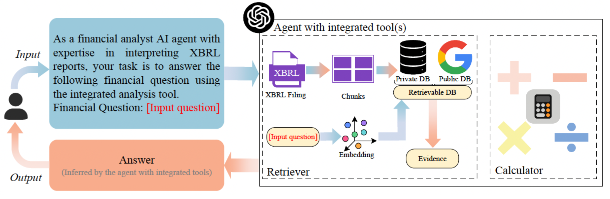

========================================================================
XBRL Agent
========================================================================

When companies submit their financial reports to regulators like the SEC, they are required to use a standardized format called XBRL. eXtensible Business Reporting Language (XBRL) is a standard language for business and data communication. XBRL acts like a coding language for financial data, ensuring that key information such as revenue, expenses, and assets is tagged in a consistent and machine-readable way. 

Feature
--------
- An LLM agent integrated with specialized tools for XBRL analysis
- improve accuracy when extracting information from XBRL documents

The Potential of XBRL Agent for Compliance
-------------------------------------------
- Saves Time and Reduces Human Error
- Makes Financial Reports Clear and Consistent
- Accelerates XBRL Application Development

The XBRL Agent integrated with specialized tools designed specifically for analyzing XBRL documents. There are two key tools: a Retriever, which brings in accurate and up-to-date financial knowledge, and a Calculator, which enhances the agent’s ability to perform precise ratio calculation. Together, these tools allow the agent to extract relevant data from XBRL filings with greater accuracy and reliability.

- Paper:

`XBRL Agent: Leveraging Large Language Models for Financial Report Analysis.ICAIF 2024. <https://dl.acm.org/doi/pdf/10.1145/3677052.3698614>`_

