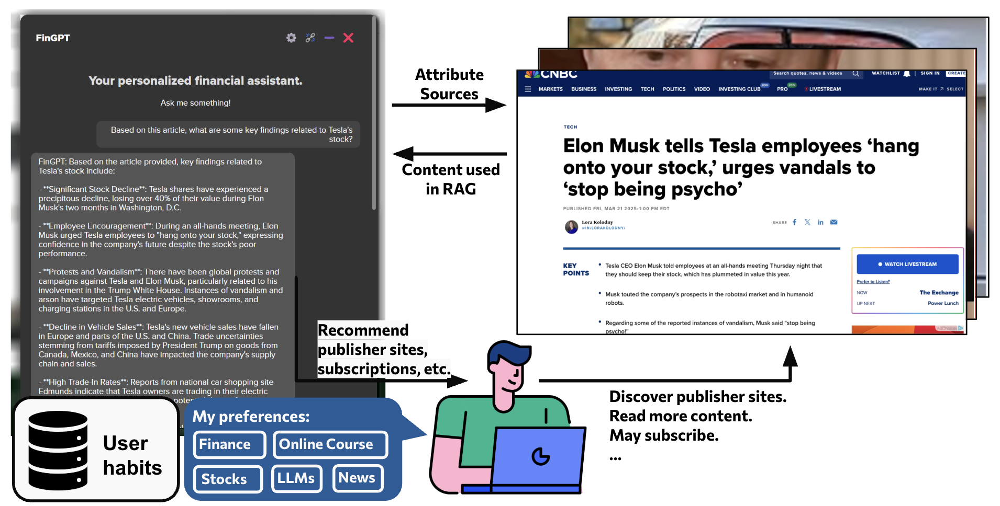

==========================
Search Agent
==========================

The `FinGPT Search Agent <https://fingpt-search-agent-docs.readthedocs.io/en/latest/>`_ is a customizable AI search agent. It can scrape and analyze websites, fetch user-specified websites, search local files, and verify the sources. 

There are many professional financial websites, such as YahooFinance and Bloomberg. They publish vast amounts of market data and news about financial markets every day. However, navigating the financial websites and interpreting information often requires profressional financial expertise. The search agent can capture their complexity and explain to the user timely and accurately. It acts as an intelligent, personalized assistant for users to navigate, extract, and interpret content from financial websites and local files. It aims to upgrade the general public to professionals and help make informed decisions. 

Features
--------

- Personalization
    - It is personalized by learning user habits and preferences from a dynamic database and user feedback.
    - Users can maintain a list of prefered websites and select LLMs.

- Search
    - Based on the user's query, the agent can scrape websites or search local files, and then extract relevant content through RAG.
    - It answers the user's query based on the retrieved content and provides the source of the information.

- Recommendation
    - It can recommends publisher sites and subscriptions. With these recommendations, users can discover publisher websites, read more content, and have a higher chance to subscribe. 

The figure shows an example using the search agent to answer a user's query about the news on Tesla. In the past six months, Tesla's stock price has fluctuated dramatically, and there has been a lot of news, pictures, and videos. The users can analyze the news with the FinGPT Search Agent.
    - The user was reading an article about Tesla on CNBC. He can directly opens the FinGPT window and asks: “based on this article, what are some key findings related to Tesla’s stock?”
    - The agent scraped the user-specified website, i.e., CNBC, extracted the relevant content, and analyzed the content using the LLMs. It provided the user with a summary of the key findings related to Tesla's stock based on this article.
    - The user can add the CNBC website to the list of preferred websites, so that the agent can scrape and analyze the CNBC website in the future.

- Paper:

`CustomizedFinGPT Search Agents Using Foundation Models. ICAIF 2024. <https://arxiv.org/pdf/2410.15284>`_

