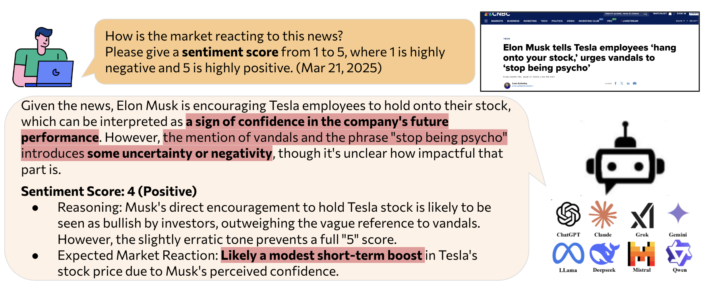
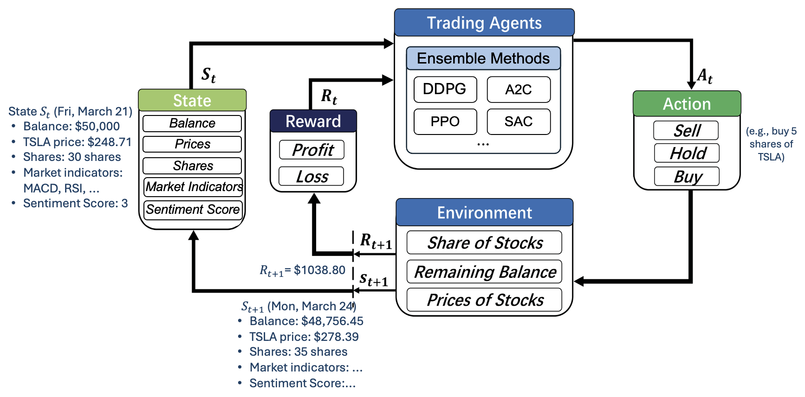
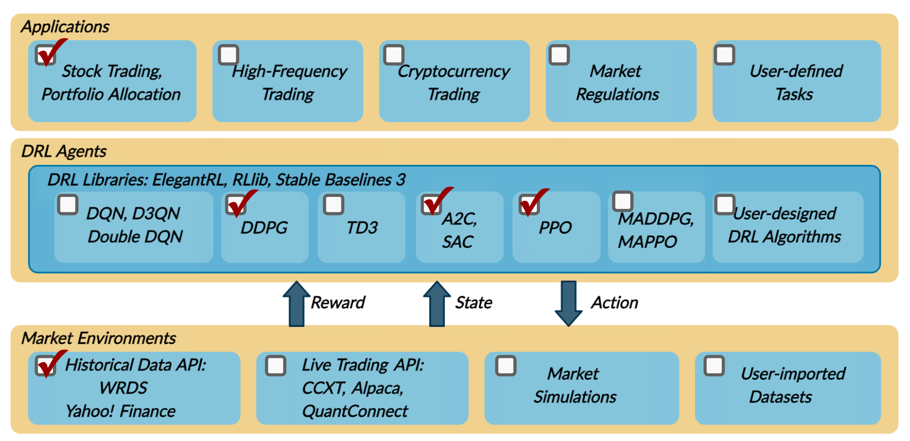

========================================================================
Trading Agent
========================================================================
In investing, generating alpha signals is crucial for making informed decisions. However, individual investors typically lack the time, resources, or professional knowledge to extract actionable signals from vast amounts of financial information. Imagine being able to ask Warren Buffett for value-investing advice, consult a risk manager to flag red flags in SEC filings, or engage a sentiment analyst to interpret the tone of market news — all instantly and on demand. **AI agents** make this possible. These LLM-powered agents, such as Warren Buffett agent, sentiment analysis agent, and risk management agent, emulate a professional investment team — personalized and accessible to any investor.

Here we show a trading agent, which uses LLM-generated signals from financial news and Financial Reinforcement Learning (FinRL) to enhance trading strategies.

  - **LLM for Seeking Alpha**. LLMs are used to analyze financial news and generate  trading signals, such as sentiment scores and risk levels.
  - **Stock Trading with RL**. These extracted signals are then integrated into the FinRL environment. The trading agent learns optimal trading strategies from both numerical and textual data.

LLM for Seeking Alpha
--------------------------------
LLMs are promising for generating alpha signals from multiple financial data sources. After using the search agent to retrieve financial information, users can further ask questions to extract trading signals for informed decision-making.

For example, based on this CNBC news on Tesla, the user can further ask question: “How is the market reacting to this news?” The LLM can interpret the article, analyze the sentiment and tone, assign a sentiment score, and provide a rationale. In this case, the LLM concludes that while the immediate market reaction appears positive, the long-term sentiment remains cautious due to ongoing challenges.

It shows the capability of LLMs in extracting actionable signals from unstructured financial documents, which can then be integrated into trading agents.

Stock Trading with RL
--------------------------------
After getting the LLM-generated signals, we integrate them into stock trading strategies using reinforcement learning (RL). RL is well-suited for financial tasks because it can solve dynamic and sequential decision-making problems, which are very common in finance.

As shown in the figure, the RL agent represents the investor, and the environment represents the financial market:

- The trading agent observes the current state of the market, which is a snapshot of market conditions. 

    - For example, the account balance is $50,000, the Tesla stock price is $248.71, the number of holding shares is 30. Market indicators can be calculated based on the market data, such as MACD and RSI. The LLM-generated sentiment score generated in the previous stage is also included, which is 3. 

- The agent then takes a trading action, such as buying, selling, or holding a stock, based on the current state and its trading strategy. 

    - For example, the agent decides to buy 5 shares of Tesla stock.

- The environment responds to the agent's action by updating the market state. 

    - For example, after buying 5 shares of Tesla stock, the account balance is updated to $48,756.45, the TSLA stock price next trading day is $278.39. The number of holding shares is updated to 35. And the market indicators and sentiment score are also updated based on the new market data and financial news.

- The environment gives rise to a reward based on the agent's action and the new state. The reward can be the change of the total asset value.

    - For example, the reward is the change in the total asset value, which is $1038.80 in this case.

- The agent receives the reward and learn from the experience to improve future actions.

Financial Reinforcement Learning (FinRL)
------------------------------------------------
Financial reinforcement learning (FinRL) applies RL algorithms to financial tasks, such as algorithmic trading, portfolio management, option pricing, hedging, and market making. Its framework consists of three layers: 

- **Application Layer**. FinRL aims to provide hundreds of demonstrative trading tasks, serving as stepping stones. For example, it has demonstrations for stock trading, portfolio allocation, crypto trading, and so on. It also allows user to self-define tasks.
- **Agent Layer**. FinRL supports fine-tuned algorithms from DRL libraries, for example, ElegantRL, RLlib, and stablebaseline3. It is in a plug-and-play manner so users can easily change and plug different agents.
- **Environment Layer**. FinRL aims to wrap historical data and live trading APIs of hundreds of markets into training environments. It has a full pipeline for downloading and preprocessing datasets from over 30 data sources.

For example, to develop the TSLA trading agent, the user can select components on different layers in a plug-and-play manner.

Paper
--------

[1] `FinRL: Deep reinforcement learning framework to automate trading in quantitative finance. ICAIF 2021 <https://arxiv.org/pdf/2111.09395>`_

[2] `Practical deep reinforcement learning approach for stock trading. NeurIPS 2018 Workshop <https://arxiv.org/pdf/1811.07522>`_

[3] `FinRL-Meta: Market environments and benchmarks for data-driven financial reinforcement learning. NeurIPS 2022 <https://proceedings.neurips.cc/paper_files/paper/2022/file/0bf54b80686d2c4dc0808c2e98d430f7-Paper-Datasets_and_Benchmarks.pdf>`_
