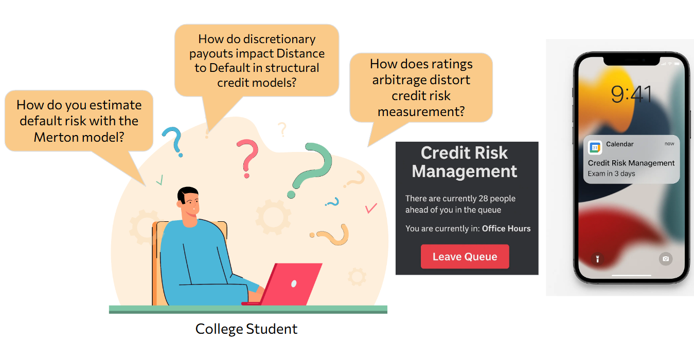
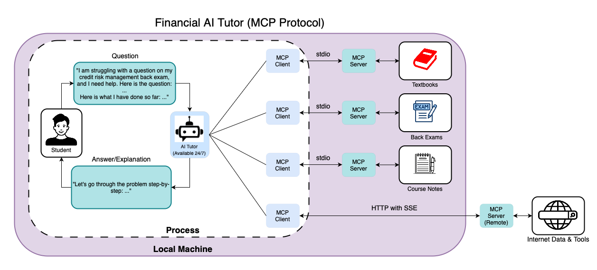

========================================================================
Tutor Agent
========================================================================

The FinGPT Tutor Agent is an intelligent financial education assistant powered by pretrained large language models. It aims to democratize financial education by providing affordable, scalable, and high-quality learning support to the general public.

   
Motivation
----------

**Affordable**
    - Providing affordable access to expensive tutoring services
    - Reducing the cost per student through AI automation
    - Making high-quality financial education accessible to everyone
    - Cost-effective deployment using pretrained LLMs

**Scalable**
    - Serving millions of users simultaneously
    - Available 24/7 without geographical limitations
    - Consistent quality of education across all users
    - Automated grading and feedback for massive student populations

**Democratizing Education**
    - Breaking down barriers to financial knowledge
    - Enabling self-learning for people from all backgrounds
    - Providing equal access to educational resources
    - Supporting diverse learning needs and styles

Features
--------

**Personalized Learning**
    - Available 24/7, replacing traditional office hours
    - Generates tailored examples and practice questions based on individual needs
    - Supports multiple educational levels: high school, university, and certificate exams
    - Provides step-by-step solution checking and error correction
    - Creates topic-specific practice questions for struggling areas

**Scalable Online Education**
    - Handles massive student populations simultaneously
    - Provides real-time answers during live lectures
    - Automated grading and feedback using advanced reasoning models
    - Acts as research advisor for independent study

Use Cases
---------

**Exam Preparation**
A student preparing for a credit risk management exam faces complex formulas and long help queues. The AI tutor provides immediate assistance, personalized examples, and step-by-step guidance without waiting time.

**Professional Development**  
A software engineer needs to quickly learn financial terms (Market Cap, EBITDA, Balance Sheet) before meeting with the FP&A team. The AI tutor delivers contextual, work-relevant explanations efficiently.

**Research Advisor**
An online student pursuing independent research in finance but lacks access to academic advisors. The AI tutor helps identify unexplored research areas, outlines research phases, and provides ongoing feedback throughout the research process.

**CFA Exam Preparation**
A CFA candidate preparing for Level II faces challenges with complex financial concepts and time management. The AI tutor can provide 24/7 access to expert-level explanations of complex topics, generate practice questions tailored to weak areas, and offer step-by-step solutions for quantitative problems.

This diagram shows how a Financial AI Tutor helps students get instant answers on finance questions—like those found in credit risk management exams. A student types a question into the system, and the AI Tutor gives back a clear, step-by-step explanation—available 24/7. Behind the scenes, the AI pulls from a variety of trusted resources like textbooks, old exams, and course notes using the MCP Protocol.

References
----------

Jaisal Patel, Xiao-Yang Liu, et al. High-Quality Financial Benchmark (QFinBen): Can LLMs Earn Degrees and Certificates?. MFFM Workshop @ ICAIF 2024.