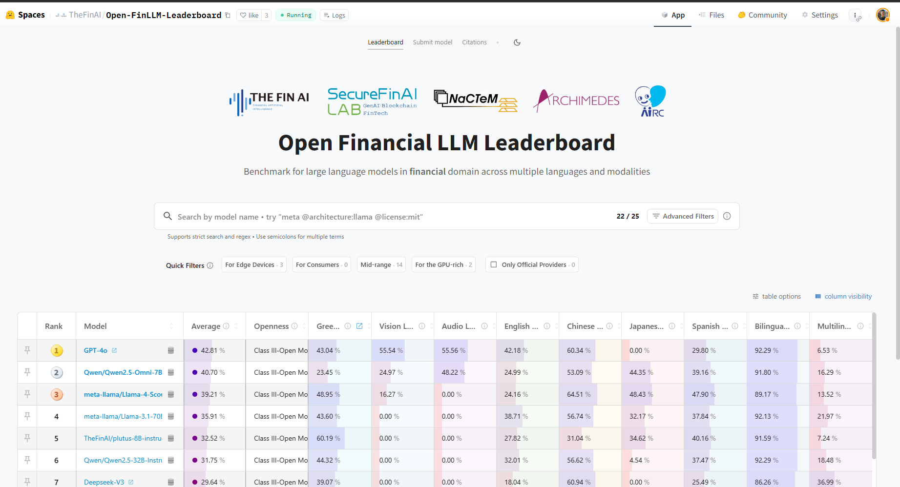
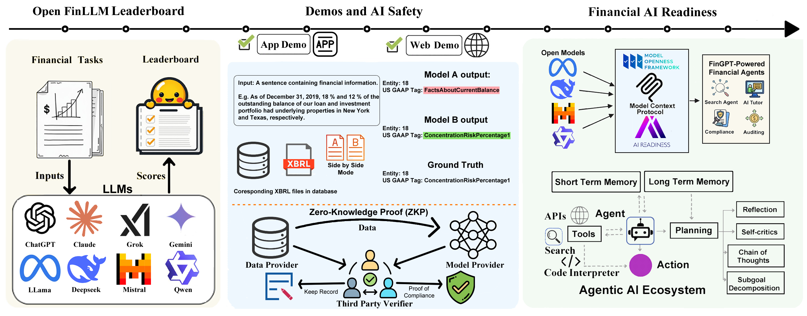

=============
Overview
=============

.. contents:: Table of Contents
   :local:

Overview
============
Welcome to the `Open FinLLM Leaderboard <https://huggingface.co/spaces/finosfoundation/Open-Financial-LLM-Leaderboard>`_!

We built the Open Financial LLM leaderboard because we want to evaluate LLMs' multimodal capabilities in different financial tasks and explore the use cases of FinAgents. 

LLMs struggled with analyzing SEC filings and failed in CFA exams. After 18 months of development,  we would like to see if LLMs are ready now.

Existing works on leaderboards and evaluation pipelines consist of a large quantity of tasks and evaluation scores. This is because we need rigerous, systematic, and measurable evaluation processes, so that the financial industry can understand the strengths and weaknesses of models.

   Huggingface Leaderboard Demo showing the performance of different models on different tasks. Each row is a model, each column is a task. The color of the cell is the score of the model on the task.

Vision
============
The OpenFinLLM Leaderboard provides an evaluation framework tailored for financial language models. Through comprehensive benchmarking of 30 LLMs across about 50 financial tasks, we aim to help researchers and practitioners identify the right model for their financial applications.

Our platform offers:

- **Comprehensive Evaluation**: Detailed assessment across seven key financial categories
- **Real-World Relevance**: Benchmarks based on actual financial industry challenges
- **Zero-Shot Testing**: Evaluation of models' ability to generalize to unseen financial tasks
- **Transparent Metrics**: Clear performance metrics for informed model selection

The growing complexity of financial language models necessitates evaluations that go beyond general NLP benchmarks. While traditional leaderboards focus on broader NLP tasks, they often fall short in addressing the specific needs of the finance industry.

Our goal is to fill this critical gap by providing:

- A transparent framework for assessing model readiness in real-world financial applications
- Specialized evaluation metrics that matter most to finance professionals
- Clear insights into model performance across different financial tasks
- A platform for continuous improvement and innovation in financial AI

Open FinLLM Leaderboard
--------------------------
This section reflects our effort where we collect diverse financial tasks and models from research teams and industries. Models are then evaluated on our leaderboard. Currently there are several opensource evaluation framework for LLMs, but each of them would give a different result even when evaluating the same model using a same dataset. Our goal is to build a reliable benchmarking framework for reference that bridges academic research with practical financial applications.

Demos and AI Safety
-------------------
At the center of the illustration, a side-by-side view is presented. Unlike conventional leaderboards that only display scores, this segment offers an online comparison demo. We show multiple actual model outputs with their corresponding performance scores to help users better understand the real-world implications of these metrics, thereby enhancing transparency and promoting AI safety.

**(ZKP) Zero-Knowledge Proof**: The lower portion of the Demos and AI Safety introduces the concept of ZKP. This planned feature aims to protect dataset privacy and prevent fraudulent behaviors such as leaderboard manipulation. With ZKP, we envision a system that can verify model performance without exposing sensitive underlying data, ensuring both integrity and security of the evaluation process.

Financial AI Readiness
----------------------
On the right, this segment embodies the primary objective of the Leaderboard: to build a gateway between academia and industry. By translating complex research achievements into accessible and actionable insights, we foster the growth of the Agentic AI Ecosystem. Much like established industry standards such as MCP and MOF, this section sets the benchmark for financial AI readiness, ensuring that innovations in financial language models are both practical and impactful.

Features
============
Financial Question Tree Structure
------------------------------------

The OpenFinLLM Leaderboard organizes financial questions in hierarchical tree structurea, designed to evaluate LLMs' capabilities in financial domains. Our goal is to build a dataset of 100,000 financial questions.

.. figure:: ./images/question_tree.png
   :width: 100%
   :align: center
   :alt: Financial Question Tree Structure

   Hierarchical structure of financial questions in the OpenFinLLM Leaderboard

The tree is organized as:

1. **Top Level - Financial Question Sets (20 sets)**
   - Major financial domains and applications

2. **Middle Level - Question Types (50 types)**
   - Examples include:
     - Financial QA
     - SEC Filing Analysis
     - Financial Statement Analysis
     - Market Analysis
     - Risk Assessment

3. **Bottom Level - Individual Questions (100 examples)**

Preventing Leaderboard Hacking
------------------------------------
Our Zero-Knowledge Proof (ZKP) implementation ensures evaluation integrity while protecting sensitive data:

- Privacy-Preserving of Datasets: Models can prove their performance without exposing training data
- Anti-Gaming Protection: Prevents leaderboard manipulation through cryptographic verification
- Data Confidentiality: Financial institutions can contribute proprietary datasets without disclosure
- Transparent Auditing: All evaluations are cryptographically verifiable while maintaining privacy

FinAgents Demos
------------------------------------
The FinAgents Demos shows applications of financial LLMs in real-world scenarios. Each demo represents a specific use case where AI can enhance financial operations and decision-making.

**Search Agent**
    - Real-time document analysis
    - Multi-source information analysis

**Tutor Agent**
    - Personalized financial education
    - 24/7 learning support

**Trading Agent**
    - Real-time market analysis
    - Trading strategy generation
    - Risk assessment and management

**XBRL Agent**
    - Financial statement analysis
    - XBRL data extraction and validation

